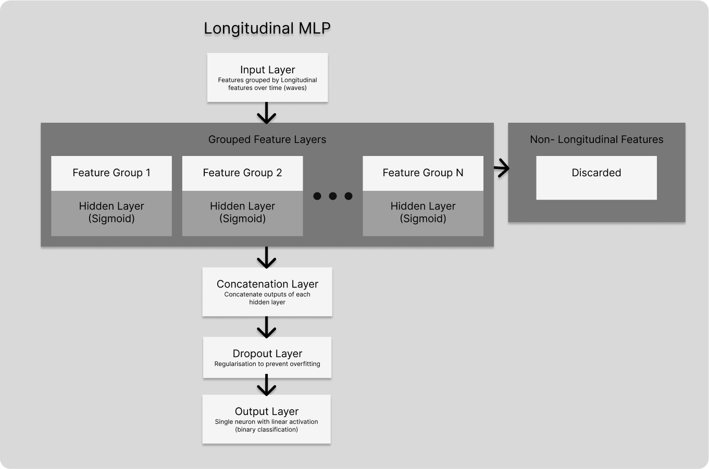

# University Masters Thesis
##  Machine Learning for Longitudinal Medical Data Analysis

The live version of this repository can be found [here](https://github.com/Vendron/longitudinal-machine-learning).

This repository contains the code and the report for my University Masters Thesis. The thesis is about the application of machine learning techniques to longitudinal medical data. The data used in this project is the [ELSA study](https://www.elsa-project.ac.uk/), a longitudinal study of ageing in the UK. The data is publicly available and can be requested from the ELSA website.

The datasets used are a filtered version of the original ELSA data, which contains only the variables that are relevant for the analysis. The data is stored in the `data` folder in the form of CSV files. This data is not publicly available and is not included in this repository.

NOTE: Only Longitudinal features are used in this project. Static features were not used.

## Project Structure:
```bash
├── data
│   ├── angina_dataset.csv
│   ├── arthritis_dataset.csv
│   ├── cataract_dataset.csv
│   ├── dementia_dataset.csv
│   ├── diabetes_dataset.csv
│   ├── hbp_dataset.csv
│   ├── heartattack_dataset.csv
│   ├── osteoporosis_dataset.csv
│   ├── parkinsons_dataset.csv
│   └── stroke_dataset.csv
├── src
│   ├── cnn
│   │   ├── CNN-GS-AUC.ipynb
│   │   ├── CNN-GS-F1.ipynb
│   │   ├── CNN-RS-AUC.ipynb
│   │   ├── CNN-RS-F1.ipynb
│   │   └── CNN.ipynb
│   ├── gru
│   │   ├── GRU-GS-AUC.ipynb
│   │   ├── GRU-GS-AUC-Output.txt
│   │   ├── GRU-GS-F1.ipynb
│   │   ├── GRU-RS-AUC.ipynb
│   │   ├── GRU-RS-F1.ipynb
│   │   └── GRU.ipynb
│   ├── lstm
│   │   ├── LSTM-GS-AUC.ipynb
│   │   ├── LSTM-GS-F1.ipynb
│   │   ├── LSTM-GS-F1-Output.txt
│   │   ├── LSTM-RS-AUC.ipynb
│   │   ├── LSTM-RS-F1.ipynb
│   │   └── LSTM.ipynb
│   ├── longitudinal-mlp
│   │   ├── long_mlp_classifier.py
│   │   ├── long_mlp_gs_auc.py
│   │   ├── long_mlp_gs_f1.py
│   │   ├── long_mlp_rs_auc.py
│   │   ├── long_mlp_rs_f1.py
│   │   └── long_mlp_pc.py # This is the original proof of concept model to demonstrate the thought process behind the project
│   ├── traditional-mlp
│   │   ├── trad_mlp_classifier.py
│   │   ├── trad_mlp_gs_auc.py
│   │   ├── trad_mlp_gs_f1.py
│   │   ├── trad_mlp_rs_auc.py
│   │   └── trad_mlp_rs_f1.py
├── results
│   ├── expierment-1
│   │   ├── GRU-INITIAL.md
│   │   ├── LSTM-INITIAL.md
│   │   ├── CNN-INITIAL.md
│   │   ├── LONGITUDINAL-MLP-INITIAL.md
│   │   └── TRADITIONAL-MLP-INITIAL.md
│   ├── expierment-2
│   │   ├── GRU-GS-F1.md
│   │   ├── GRU-GS-ROC-AUC.md
│   │   ├── LSTM-GS-F1.md
│   │   ├── LSTM-GS-ROC-AUC.md
│   │   ├── CNN-GS-F1.md
│   │   ├── CNN-GS-ROC-AUC.md
│   │   ├── LONGITUDINAL-MLP-GS-F1.md
│   │   ├── LONGITUDINAL-MLP-GS-ROC-AUC.md
│   │   ├── TRADITIONAL-MLP-GS-F1.md
│   │   └── TRADITIONAL-MLP-GS-ROC-AUC.md
│   ├── expierment-3
│   │   ├── GRU-RS-F1.md
│   │   ├── GRU-RS-ROC-AUC.md
│   │   ├── LSTM-RS-F1.md
│   │   ├── LSTM-RS-ROC-AUC.md
│   │   ├── CNN-RS-F1.md
│   │   ├── CNN-RS-ROC-AUC.md
│   │   ├── LONGITUDINAL-MLP-RS-F1.md
│   │   ├── LONGITUDINAL-MLP-RS-ROC-AUC.md
│   │   ├── TRADITIONAL-MLP-RS-F1.md
│   │   └── TRADITIONAL-MLP-RS-ROC-AUC.md
│   └── DATA-CLASS-DISTRIBUTION.md
├── assets
│   └── img
│       ├── long-MLP-schema.png
├── .gitignore
├── .env.example
├── README.md
├── docker-compose.yml
├── Dockerfile
└── requirements.txt
```

## This project is split into three experiements:
1. **Experiment 1:** Results of the baseline models on the ELSA data. 
*No hyperparameter tuning is performed in this experiment.*
2. **Experiment 2:** Grid search hyperparameter tuning for the best performing models from Experiment 1.
3. **Experiment 3:** Random search hyperparameter tuning for the best performing models from Experiment 1.

## Results:
Results of each of the experiments are stored in the `results` folder. The results include the performance metrics of the models, the confusion matrices, and the hyperparameters used for each model as well as either F1, precision and recall or ROC-AUC scores.

Precision and Recall scores were recorded in addition to F1 scores to better understand the performance of the models. 
- Precision is the ratio of correctly predicted positive observations to the total predicted positives. 
- Recall is the ratio of correctly predicted positive observations to the all observations in actual class.

## Naming Convetions:
"GS" for Grid Search and "RS" for Random Search, followed by the model name, the dataset name, and the metric used for evaluation.

For example, the file name `GRU-GS-F1.csv` indicates that the file contains the results of the Grid Search hyperparameter tuning for the GRU model on the ELSA data using the F1 score as the evaluation metric.

Inside you will find 10 tables, one for each dataset in the data directory. These tables show the statistics for each dataset in the data directory. These statistics can be used to compare the datasets and understand the class distribution.

## Models Overview:
1. **Longitudinal MLP:** A simple feedforward neural network model that uses the longitudinal features of the data.
Model Architecture:

2. **Traditional MLP:** A simple feedforward neural network model that uses the longitudinal features of the data, in a flattened format. (Does not split the features into groups for each hidden layer).
3. **LSTM:** A Long Short-Term Memory model that uses the longitudinal features of the data.
4. **GRU:** A Gated Recurrent Unit model that uses the longitudinal features of the data.
5. **CNN:** A Convolutional Neural Network model that uses the longitudinal features of the data.

> Note: The MLP models utilize Scikit-Longitudinal. Follow the [installation instructions](https://simonprovost.github.io/scikit-longitudinal/quick-start/#installation) for setting up this library. A Linux virtual environment was required to run the MLP models.